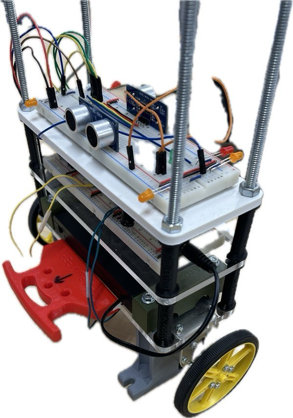
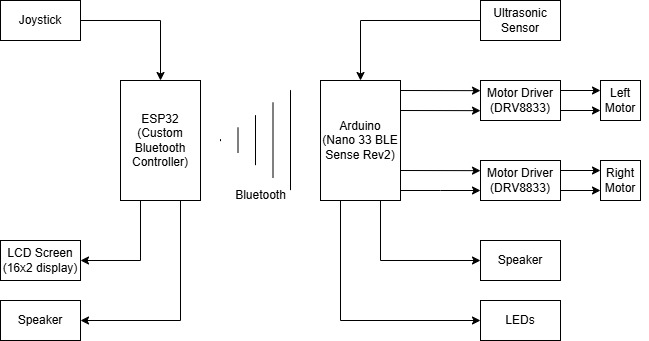
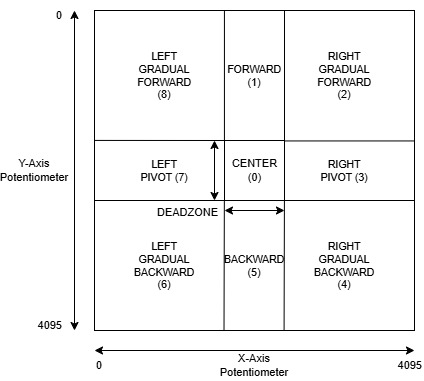
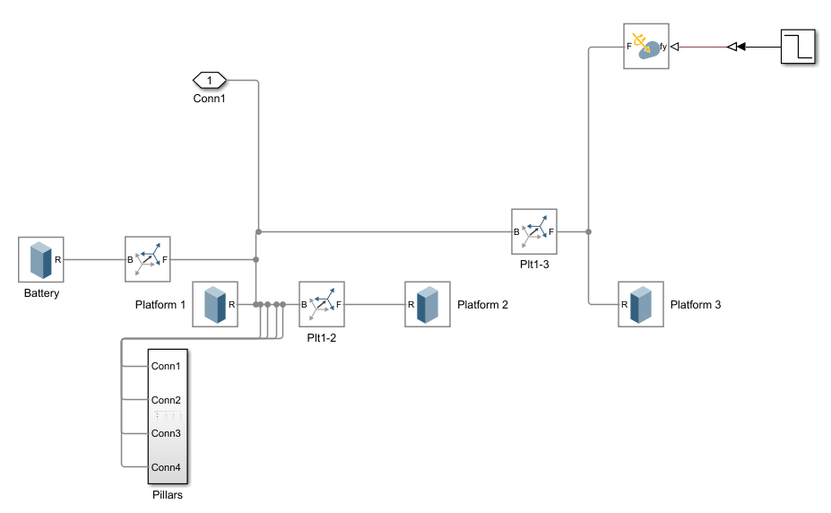
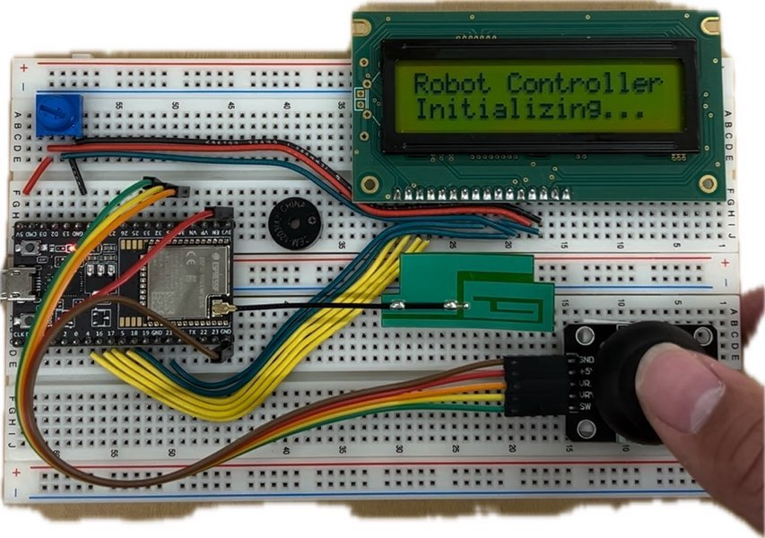
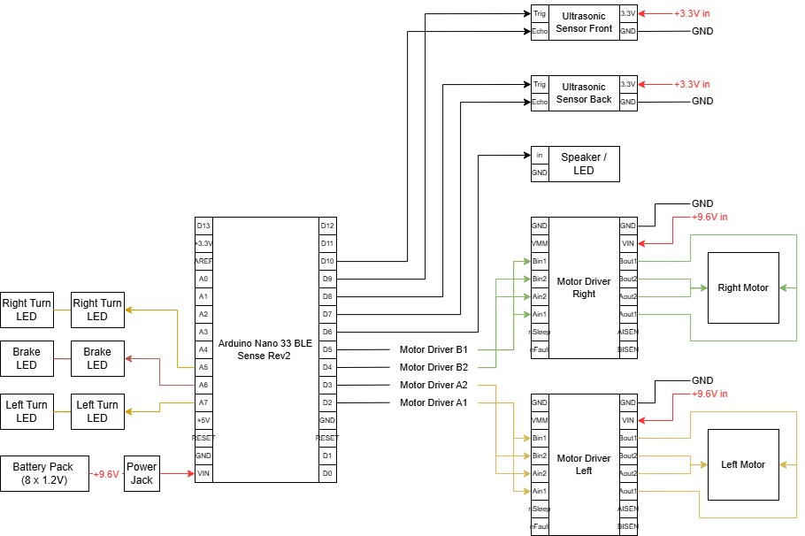
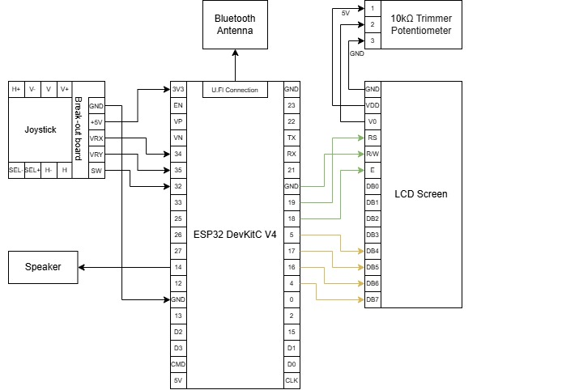

# Self-Balancing Robot

<p align="center"></p>

A robot that balances on two wheels and refuses to fall over. My team and I built it for ELEC 391 at UBC (January to April 2025). An Arduino reads a motion sensor, works out how far the robot is tipping, and drives the wheels to catch it. An ESP32 remote with a joystick and an LCD drives it around over Bluetooth.

**Full write-up:** [plundis.github.io/#proj/self-balancing-robot](https://plundis.github.io/#proj/self-balancing-robot)

## What it does

- Balances upright on two wheels with a PID control loop
- Drives forward, backward and turns from a Bluetooth joystick remote
- Watches for obstacles in front and behind with two ultrasonic sensors, and beeps faster as they get closer
- Keeps balancing even if the Bluetooth link drops

## How it works

<p align="center"></p>

**Sensing the tilt.** The Arduino's built-in IMU has an accelerometer and a gyroscope. Neither is good enough on its own. The accelerometer is noisy and the gyroscope drifts. A complementary filter blends them (99% gyroscope, 1% accelerometer) into one clean tilt angle. The gyroscope is also calibrated at start-up so the robot doesn't slowly roll away.

**Staying upright.** A PID loop compares the tilt to upright and sets the motor power. If the robot tips past 35 degrees it can't recover, so the code cuts the motors instead of driving them into the floor.

**Driving.** To move, the robot shifts its balance point slightly forward or back and lets the controller do the rest. Turning comes from running the two wheels at different speeds.

**Bluetooth.** The robot is the Bluetooth server and the ESP32 remote connects to it. The remote reads the joystick, turns its position into one of nine direction codes, sends it to the robot and shows it on the LCD.

<p align="center"></p>

**Tuning.** We got starting PID gains from a Simulink model of the chassis, then tuned them on the real robot with the Ziegler-Nichols method. The final gains are Kp = 8.0, Ki = 95.0, Kd = 0.35.

<p align="center"></p>

## Hardware

| Part | What it does |
|---|---|
| Arduino Nano 33 BLE Sense Rev 2 | Main controller, with a built-in IMU and Bluetooth |
| DRV8833 motor drivers (two in parallel per motor) | Drive the two DC motors |
| 2 × HC-SR04 ultrasonic sensors | Measure the distance to obstacles in front and behind |
| ESP32 DevKit, joystick, 16×2 LCD, piezo speaker | The remote |
| 8 × NiMH cells (9.6 V) | Power for the robot |

<p align="center"></p>

## Repository layout

```
robot/robot.ino                 Final robot firmware (balancing, motors, sonar, Bluetooth)
remote/remote.ino               ESP32 remote (joystick, LCD, Bluetooth)
simulation/angle_simulation.m   MATLAB simulation of the tilt sensing
images/                         Photos, schematics and diagrams from our report
archive/                        Earlier versions and test sketches, kept for reference
```

## Running it

**Robot.** Open `robot/robot.ino` in the Arduino IDE, select the Arduino Nano 33 BLE board, install the `ArduinoBLE` and `Arduino_BMI270_BMM150` libraries, and upload.

**Remote.** Install the ESP32 board package, open `remote/remote.ino`, select your ESP32 board and upload. It uses the ESP32's built-in BLE library and `LiquidCrystal`.

**Note.** The remote in this repo uses the first version of our Bluetooth link (a single characteristic). The final robot firmware moved to three characteristics (joystick commands, tilt angle and sonar distances), and the matching update to the remote isn't in this repo.

## Results

- Drift under 1 cm/s and wobble within 2 cm while standing still, after switching the motor drivers to slow-decay PWM
- Running two motor drivers in parallel cut the power needed to get the wheels moving from 15–20% to 10%, which made fine balance corrections possible
- Bluetooth link stable past 25 m (the requirement was 5 m)
- Ultrasonic distance readings accurate to within 0.5 cm
- Recovered from tilts of up to 10 degrees. The target was 15, and motor torque was the limit.

## Schematics

<p align="center">
  
  
</p>

## Team

Built by a team of three for ELEC 391 (Electrical Engineering Design Studio II) at UBC: [@plundis](https://github.com/plundis), [@AlexLamyin](https://github.com/AlexLamyin) and [@m-yan13](https://github.com/m-yan13).
